# Intelligence artificielle

Les différentes étapes : 

1. Récupérer des données liées à notre champ d'étude, le plus possible
2. Nettoyer les données, s'assurer qu'elles sont bien fiables, qu'il n'en manque pas, qu'elles sont consistantes, sans valeurs aberrantes et dans le même format
3. Data mining, on calcule des paramètres, on peut soulever des hypothèses et même y répondre, on fait de la data visualisation (graphiques, ...) afin de comprendre les différents comportement et de bien saisir le phénomène sous-jacent
4. Modélisation, l'objectif est de trouver un modèle du phénomène à l'origine des données à l'aide de lequel on va pouvoir effectuer des prédictions. Ensuite, il faut implémenter l'algorithme adéquat, afin de construire de modèle qui se rapprochera le plus des données d'exemple. Il faut enfin entrainer le modèle avant de  pouvoir faire des prédictions
5. Evaluer et interpréter les données, on évalue la qualité du modèle, s'il est pertinent
6. Mettre le système en production

### Le machine learning

Pour qu'un programme puisse exécuter une tâche pour laquelle il n'est pas programmé explicitement, il faut:
* des données relatives à ladite tâche. Ce sont les exemples que l'on va fournir à l'algorithme pour qu'il puisse apprendre et devenir plus performant
* un algorithme, son objectif est de transformer nos données en un modèle
* mesurer la performance de l'algorithme
* c'est l'apprentissage, qui va permettre de construire le modèle.

### Choisir ses données

Il faut utiliser le jeu de données (dataset) à notre disposition à bon escient.
Une bonne pratique est de séparer notre dataset en 3 paquets:
* le dataset d'entrainement, qui sera uniquement utilisé pour entrainer l'algorithme (il faut s'assurer que l'échantillon soit bien représentatif de toutes les données, pour ça généralement on récupère aléatoirement des échantillons dans notre jeu de données)
* le dataset de test, qui servira à mesurer l'erreur (et donc la performance) du modèle sur des données qu'il n'a jamais vues. L'algorithme ne sera donc pas entrainé avec ces données.
* le dataset de validation, qui servira à valider ou non notre modèle en mesurant l'erreur de prédiction (validation croisée)

Alternativement, on peut séparer notre jeu de données en uniquement deux parties : 
* jeu d'entrainement
* jeu de test
On sépare le jeu de données en un jeu d’entraînement et un jeu de test. On évalue chaque modèle en validation croisée sur le jeu d’entraînement pour choisir le meilleur, que l’on applique ensuite au jeu de test.

> :information_source: En général, on sépare les données suivant la proportion 80:20. Il est aussi commun de standardiser les données.

### Les différents types d'apprentissages

**Apprentissage supervisé**

> :information_source: On possède des données déjà classés/connues/étiquettés servant de base à la prédiction. Le but est de minimiser l'erreur entre la réponse de la machine et la réponse attendu (donnée par les données d'entrée).

Permet de répondre à des problématiques de classifications et de régressions.

L'apprentissage est dit supervisé lorsque les données qui entrent dans le processus sont déjà catégorisées et que les algorithmes doivent s'en servir pour prédire un résultat en vue de pouvoir le faire plus tard lorsque les données ne seront plus catégorisées.

L'idée consiste donc à associer un label à des données sur lesquelles on a des mesures.
* si les labels sont discrets on parle de classifications
* si les labels sont continus on parle de regression

Les étapes :
1. dataset (y:target, x:features)
2. modèle (régression linéaire,logistique...)
3. fonction de coût (l'erreur quadratique moyenne)
4. algorithme de minimisation de la fonction de coût (moindres carrées, descente du gradient...)

> :information_source: Ici, la notion principale est celle de perte d'information (loss) dû à l'approximation de la réalité (notre modèle perd de l'information par rapport à la réalité observée à travers les données d'exemple). L'apprentissage se résume à minimiser cette fonction de perte afin que notre modèle soit le meilleur possible.

**Apprentissage non supervisé**

> :information_source: On ne possède pas de données déjà classés/connues servant de base à la prédiction. Le but est que notre programme puisse reconnaitre des structures (des différences/ressemblances) dans les exemples qu'on lui montre

Le système va devoir détecter les similarités dans les données qu'il reçoit et les organiser en fonction de ces dernières.
On doit:
1. classer les donner : comme on n'a pas encore les labels/étiquettes, on parle de clustering
2. diminuer le nombre de dimensions de nos données (car souvent on dispose de beaucoup de paramètres), tout en conservant l'essentiel de l'information

**Apprentissage par renforcement**

> :information_source: Le but est d'apprendre, à partir d'expériences successives, ce qu'il convient de faire de façon à trouver la meilleure solution. On laisse l'algorithme apprendre de ses propres erreurs

Le procédé est intéractif et itératif. La machine fait face à un problème, elle observe son environnement, choisit une solution parmi plusieurs possibles, observe la réaction de l'environnement et adapte son comportement pour la prochaine itération afin de trouver la meilleure stratégie.
L'IA est donc confronté à des choix. Si elle se trompe, elle est pénalisée sinon elle est récompensée. Afin d'obtenir toujours plus de récompenses, l'IA va faire de son mieux pour obtimiser sa prise de descision.
Le développeur se contente de fixer les règles qui détermine si l'IA sera récompensée ou punie.

**Apprentissage par transfert**

> :information_source: On transfère des connaissances d'une/plusieurs tâches sources vers une/plusieurs tâches cibles

On utilise des connaissances acquises pour les ré-appliquer dans un autre environnement. Pour être efficace, l'environnement cible ne doit pas être trop différent de l'environnement source.
Ex: les connaissance acquises pour reconnaitre des voitures peuvent être utilisées pour reconnaitres des camions

Chacun de ces types d'apprentissages peut s'appuyer sur différents algorithmes.

### Les différents algorithmes

**Régression linéaire**

> :information_source: algorithme d'apprentissage supervisée. A partir d'une variable cible, le modèle à pour but de faire une prédiction grâce à des variables dites explicatives

Il faut déterminer une équation de droite/plan qui se rapproche au plus près de l'ensemble de points étudiés.
[La méthode des moindres carrés](https://eli.thegreenplace.net/2014/derivation-of-the-normal-equation-for-linear-regression) nous donne l'estimateur qui minimise les erreurs: (XtX)-1XtY 

La méthode de descente du gradient est quand même plus commune (car ne demande pas de calculer l'inverse de matrice)

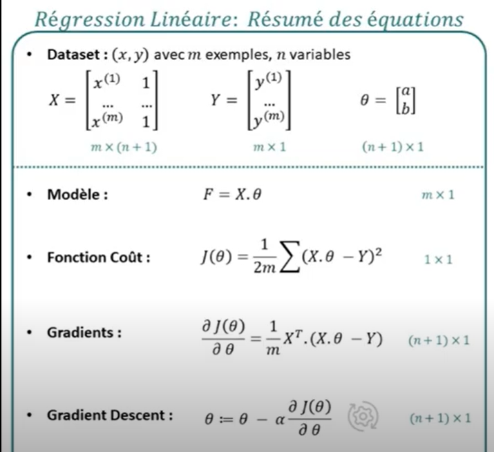

Lorsqu'il y a plusieurs paramètres, que le modèle qui rassemble le plus au données n'est plus une droite mais un polynôme, on parle de régression linéaire multiple. Le principe est de convertir les équations en matrices afin de simplifier le problème.
  
**KNN (K-nearest-neighbors)**
  
> :information_source: algorithme d'apprentissage supervisée. Recherche des k plus proches voisins entre la donnée à prédire et les données connus. Cet algorithme est non paramétrique, il se base uniquement sur les données d'entrainement.

> :warning: pour que cette algorithme fonctionne, il faut que le nombre de paramètres soit petit
  
On dispose d'une base de données d'apprentissage constituée de N couples 'entrée-sortie'. Pour estimer la sortie associée à une nouvelle entrée x, on prend en compte les k échantillons d'appprentissage dont l'entrée est la plus proche de la nouvelle entrée x, selon une distance à définir. Le type de la sortie associé à x sera alors le type de sortie le plus représenté parmi les k échantillons.

k est ce qu'on appelle un hyperparamètre, c'est à dire que ce n'est pas un paramètre qui va pouvoir être appris par l'algorithme. On va chercher à trouver la meilleure valeur de k possible pour minimiser l'erreur sur les données de test.

[Plus d'information](https://cache.media.eduscol.education.fr/file/NSI/76/6/RA_Lycee_G_NSI_algo_knn_1170766.pdf)

**K-means**

> :information_source: algorithme d'apprentissage non supervisée. L'algorithme accepte un ensemble de données non étiqueté, puis regroupe les données en plusieurs groupes différents.

Il s'agit d'un algorithme itératif. Supposons que nous voulons regrouper les données en n groupes. La méthode est la suivante:
1. On sélectionne k points aléatoires, appelés centres de gravité du cluster
2. Pour chaque donnée de l'ensemble de données, on calcule la distance par rapport aux k points centraux et on sélectionne le point central avec la distance la plus proche. On associe les données à ce point central. Tous les points associés au même point central sont regroupés
3. On calcule la valeur moyenne de chaque groupe et on déplace le point central associé au groupe vers la position de la valeur moyenne

On répète les étapes 2 et 3 jusqu'à ce que le point central ne change plus.

**Descente de gradient**

> :information_source: algorithme d'optimisation pour l'apprentissage supervisée qui permet de trouver le minimum de la fonction de coût qui est convexe

La fonction de coût est convexe, elle admet donc un minimum.

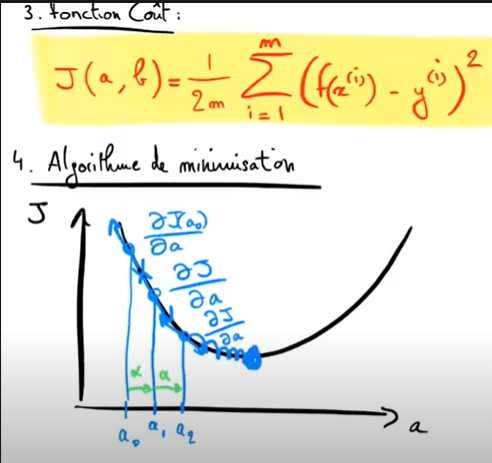 | 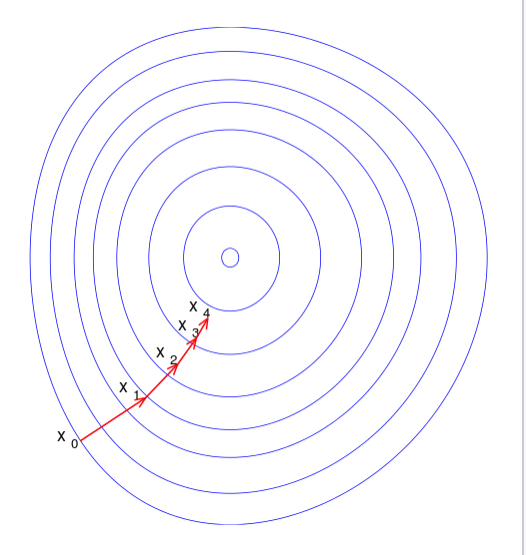
:----------------------------------:|:----------------------------------------:
alpha est le learning rate          | la fonction de coût dépend en réalité de plusieurs paramètres (ici a et b) ce qui donne l'image ci dessus vu de en haut

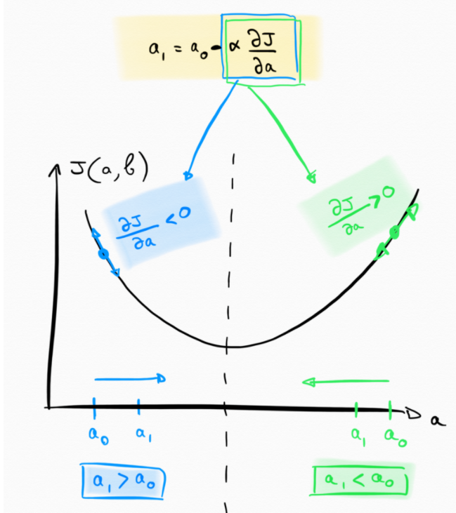

alpha est choisit aléatoirement, il faut faire attention de: 
* ne pas en choisir un trop grand (sinon oscillation et on ne pourra jamais atteindre le minimum)
* ne pas en choisir un trop petit (sinon temps infini)

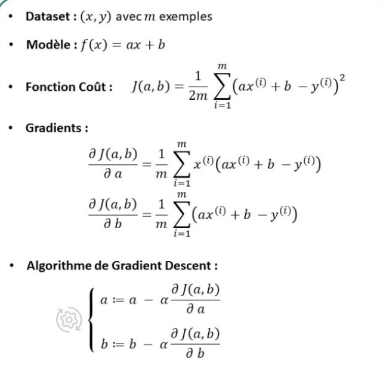

### Compromis entre biais et variance

Un modèle est très dépendant du dataset d'entrainement. On le voit très bien avec l'algorithme KNN avec k = 1: l'algorithme sera parfait pour les données d'entrainement mais beaucoup moins pour les données de test!  
Comme on ne veut pas de cette variabilité, on va faire en sorte que la variabilité vis à vis du dataset d'entrainement diminue. Pour ça, dans le cas de KNN, on va augmenter k.  
Cependant, augmenter k vas créer un autre type d'erreur, appelé biais. Le biais est lié à la complexité du modèle: Plus celui ci est complexe et plus le biais diminue.
Dans le cas de KNN, augmenter drastiquement k rend le modèle plus simple, et donc le biais est élevé. Un modèle trop simple ne parvient pas à capturer toute la complexité du problème.

Il faut trouver un bon compromis entre variance forte et biais élevé (bias-variance tradeoff)

1. réduire le nombre de dimensions du modèle (simplifie le modèle et donc diminue la variance ex: PCA,Isomap)
2. utiliser des méthodes ensemblistes (il existe toute une famille d'algorithme appelés les méthodes d'ensembles qui se basent sur la combinaison de plusieurs modèles à haute variance et les agrègent (p. ex. en les moyennant) pour réduire la variance finale)
3. Sélectionner et entrainer le bon modèle

### surapprentissage et sousapprentissage

Le surapprentissage désigne le fais que le modèle choisi est trop collé au dataset d'apprentissage. C'est un problème qui survient quand la complexité du modèle est trop élevée, et il prend en compte du "bruit" non représentatif du modèle sous-jacent. C'est ce qui arrive aux modèles avec une haute variance.

A l'inverse, les modèle avec un biais élevée sont en sousapprentissage, et peuvent rater des informations importantes.

La régularisation est une technique visant à limiter le surapprentissage. On impose au modèle des contraintes, afin de le simplifier.
1. régularisation dropout, les poids des coefficients sont remplacés par 0 de manière aléatoire
2. régularisation euclidienne, on favorise les coefficients faibles
3. early stopping, l'apprentissage s'arrête plus tôt

Une fois qu'on a trouvé le juste milieu l'algorithme est généralisable, il peut effectuer les prédictions les plus performantes possibles avec le moins de données possibles. 

Compromis entre biais et variance | erreur test vs entrainement | surapprentissage vs sousapprentissage |
:--------------------------------:|:---------------------------:|:------------------------------------:
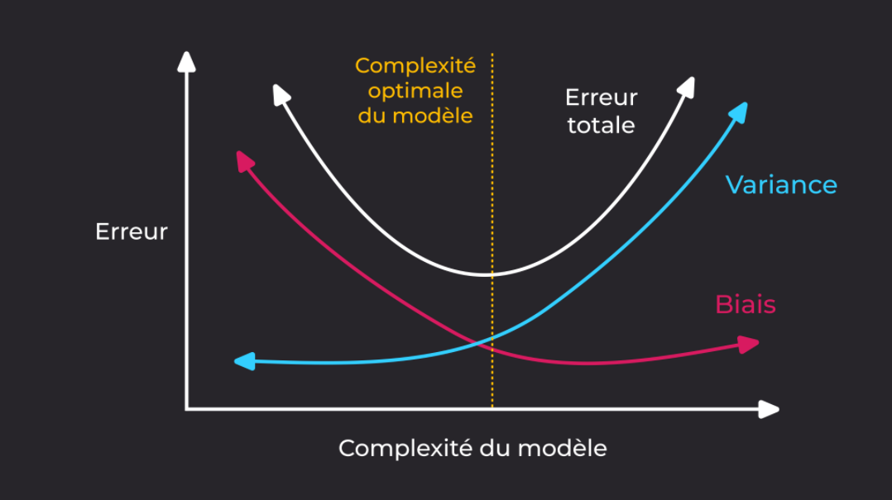 | 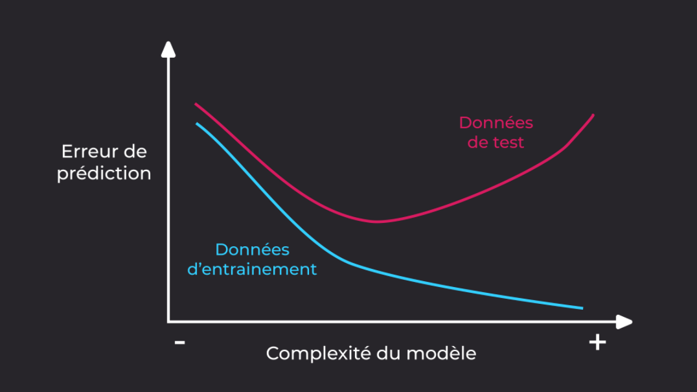 | 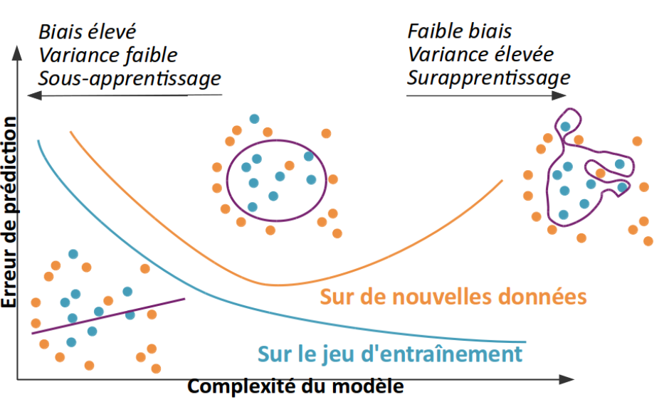

### Problème de dimension

Pour un nombre de paramètre donné, plus la dimension de l'espace augmente et plus il faudra de données d'entrainement pour notre modèle. C'est ce qu'on appele le phénomène de curse of dimensionality qui se visualise très bien avec l'alorithme KNN.

Notre modèle doit donc être assez contraint pour pouvoir supporter les variations dimensionnelles sans augmenter en complexité.

### Evaluer les performances d'un modèle

On a vu qu'il fallait couper notre jeu de données en au moins deux parties : 
* un dataset pour l'entrainement
* un dataset pour le test

Il ne faut jamais évaluer un modèle sur des points qui ont été utilisés pour l'entrainer.

Cependant, on utilise du coup qu'une partie de nos données pour entrainer l'algorithme, si le dataset de test est très facile/dificile à prédire, l'estimation de la performance sera biaisé.

A la fin d'éviter ce problème, on utilise la validation croisée, qui va permettre d'utiliser l'intégralité de notre jeu de données pour l'entrainement et pour la validation.

Le principe consiste à découper le jeu de données en k parties (fold) à peu près égales. Tour à tour, chacune des k parties (souvent 5 ou 10) est utilisé comme un dataset de test. Le reste (les k-1 parties) est utilisé pour l'entrainement.

A la fin, chaque donnée a servit 1 fois dans le dataset de test et k-1 fois dans le dataset d'entrainement.  

La stratification consiste à faire des folds les plus variés possibles, afin que chaque fold puisse contenir un maximimum d'informations différentes.

Généralement, on veut essayer plusieurs modèles pour choisir le plus performant, et ensuite donner sa performance.

> :warning: il ne suffit pas de faire une validation croisée sur l'ensemble des données pour chaque modèle. Car on utiliserais alors des données de tests pour choisir le modèle (risque de surapprentissage).

Pour faire ça correctement, il faut séparer notre jeu de données en 3 parties:
* jeu d'entrainement -> sert à entrainer divers modèles
* jeu de validation -> sert à sélectionner un modèle : on choisit celui qui a la meilleure performance sur ce jeu
* jeu de test -> sert à estimer la performance de généraliation du modèle

Alternativement, on peut ne créer que 2 parties:
* jeu d'entrainement
* jeu de test
On évalue chaque modèle en validation croisée sur le jeu d’entraînement pour choisir le meilleur, que l’on applique ensuite au jeu de test.

Dans un problème de classification (renvoie des valeurs binaires), on utilise le nombre d'erreurs comme mesure de performance. Mais toutes les erreurs ne se valent pas.  
On peut tracer une matrice de confusion. 
Pour chaque classe, indique le nombre de vrais positif (TP), faux positifs (FP) ainsi que vrais négatifs (TN) et les faux négatifs (FN)

* La sensibilité (sensitivity) = TP/TP+FN est le taux de vrais positifs.
* La précision = TP/TP+FP est la proportion de prédictions correctes parmi les points que l'on a prédits positifs.
* La moyenne est la F-mesure = 2*TP/(2*TP+FP+FN)
* la spécificité = TN/FP+TN  est le taux de vrais négatifs
* antispécificité = FP/FP+TN est le taux de faux positifs

Cependant la plupart des algorithme retournent un nombre réel (ils peuvent souvent être interprétées comme la probabilité que le point appartiennent à la classe positive.). Dans ce cas, pour retourner une valeur binaire, il faut seuiller: si le score retourné est supérieur au seuil alors on prédit positif sinon négatif.  

Pour un modèle de regression, ce n'est pas approprié de compter le nombre d'erreurs de prédiction que fait le modèle.  
On utilise la fonction de coût 

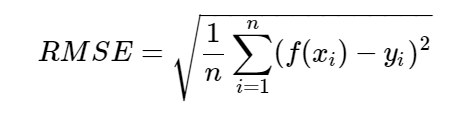

on peut aussi utilise le RMSLE, si les valeurs à prédire n'ont pas le même ordre de grandeur
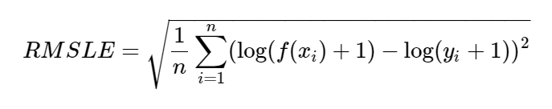

et enfin on peut calculer le coefficient de corrélation

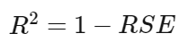

avec 

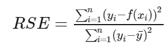

cas | si réponse + | si réponse - |
:--:|:------------:|:-------------:
x>=S| TP|FP
x<S|FN|TN

Par exemple, 

Etiquette|	+	|	-	|	+	|	+	|	-	|	-	|
:-------:|:----:|:-----:|:-----:|:-----:|:-----:|:-----:|
Score    | 0.99 | 0.95  | 0.51  | 0.45  |  0.10 | 0.01  |

Alors

Seuil    |	1	|	[0.99,0.95[	|	[0.95,0.51[	|	[0.51,0.49[	|	[0.45,0.10[	|	[0.10,0.01[		| 0 |
:-------:|:----:|:-------------:|:-------------:|:-------------:|:-------------:|:-----------------:|:--|
TP/P     |   0 	|      1/3  	|      1/3	  	|      2/3  	|       1	 	|        1		  	| 1 |
FP/P     |   0  |       0  		|      1/3		|      1/3		|      1/3		|       2/3			| 1 |

En effet, pour [0.95,0.51[, on a 
* TN = 2 (car en dessous du seuil, on est sensé avoir du négatif, ce qui est bien le cas pour 0.10 et 0.01)
* FN = 1 (car 0.45 est positif alors qu'il devrait être négatif car en dessous du seuil)
* TP = 1 (car 0.99 qui est au dessus du seuil est bien positif)
* FP = 1 (car 0.95 qui est >= au seuil est négatif alors qu'il devrait être positif)

On peut ensuite construire la courbe ROC (sensibilité en fonction de l'antispécificité)

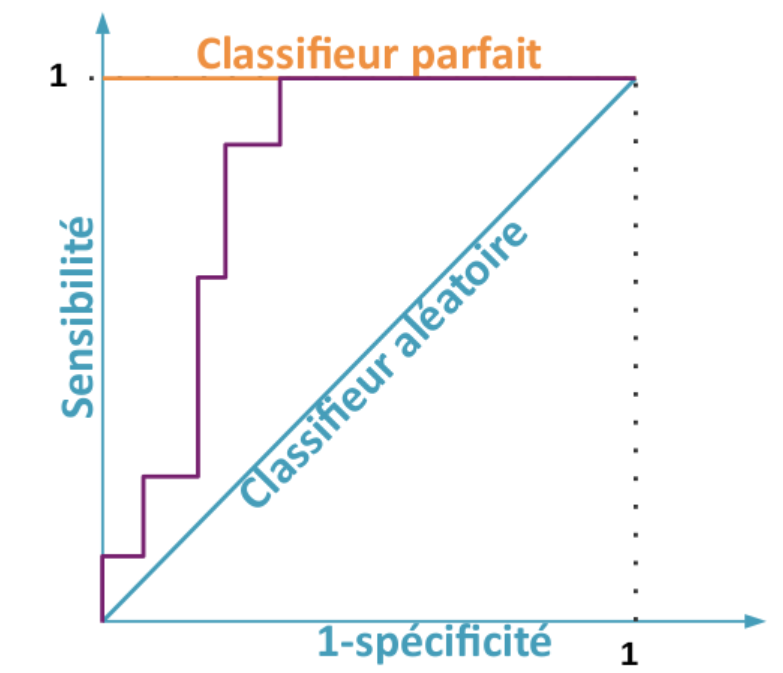

Plus l'aire sous la courbe est grande, moins l'algorithme fait d'erreur.

En plus de la courbe ROC, il existe:
* PR curve (précision en fonction de la sensibilité)
* fit curve (la sensibilité en fonction de la fraction du jeu de données parcourue)

### Courbe d'apprentissage

> :information_source: L'erreur est la fonction de coût  

La courbe d'apprentissage est un graphique avec l'erreur d'apprentissage et l'erreur de validation en fonction du nombre d'échantillon de l'ensemble de jeu.

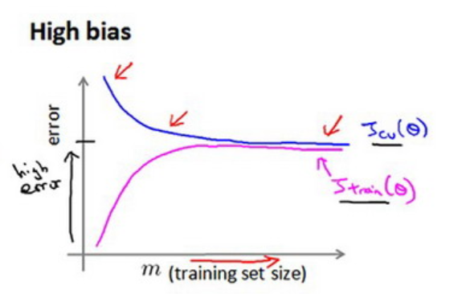

Ici par example, on voit que augmenter la taille du jeu d'entrainement n'est pas utile (car ne permettra pas de diminuer l'erreur)

### Conception de systèmes

* commencer par un modèle simple, avoir des résultats rapidement même s'ils ne sont pas très bons
* implémenter l'algorithme et le tester avec les données de validation
* courbe d'apprentissage, on découvre si l'algorithme à des problèmes (biais,variance...)
* analyse des erreurs : ajouter plus de variables, augmenter le jeu de données ?
* retester, changer de modèle pour l'améliorer ....

> :information_source: il existe une hypothèse comme quoi, la personne qui réussit n'est pas la personne avec le meilleure algorithme, mais la personne avec le plus de données

### Comment coder

On code généralement en python puisque c'est le langage qui possède le plus de librairies pour la data science
Les librairies les plus utilisées sont:
* numpy
* pandas
* matplotlib
* sklearn
* tensorflow
* seaborn

### Plus d'info

* [machine learnia](https://machinelearnia.com/)
* [makina](https://makina-corpus.com/blog/metier/2017/initiation-au-machine-learning-avec-python-pratique)
* [reseau de neurone](https://www.math.univ-toulouse.fr/~besse/Wikistat/pdf/st-m-app-rn.pdf)
* [openclassroom](https://openclassrooms.com/fr/courses/4011851-initiez-vous-au-machine-learning)
* [github](https://github.com/loveunk/Deep-learning-books)
* [note machine learning et librairies](https://github.com/loveunk/machine-learning-deep-learning-notes) (en chinois mais avec chrome -> extension google translate: traduire en Fr)

