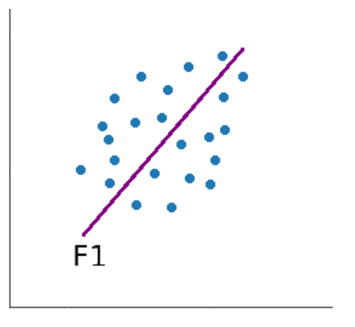
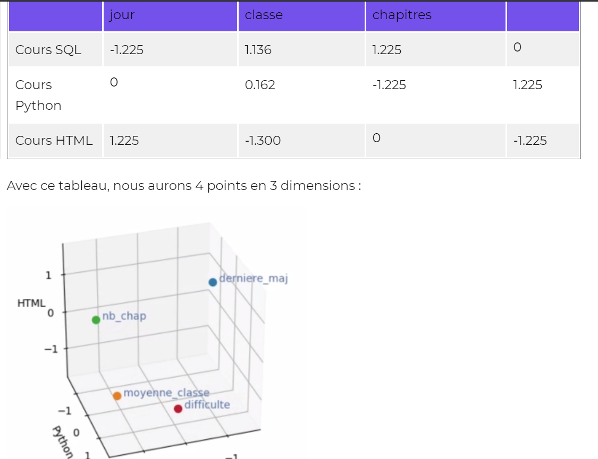
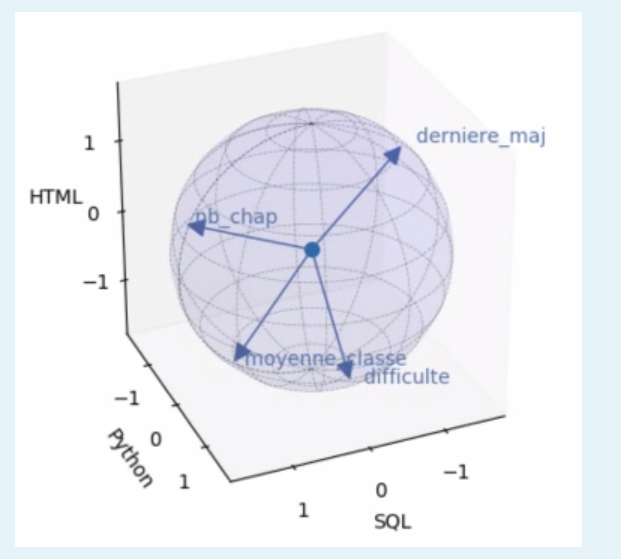
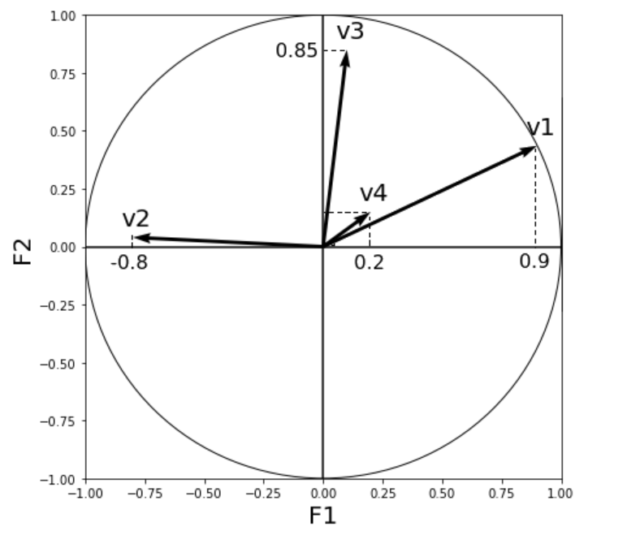

L'analyse multivariée est utile quand on souhaite étudier des profils, c'est-à-dire un ensemble de caractéristiques d'un individu.

## méthodes factorielles & classification non supervisée (clustering)

>:information_source: l'analyse en composante principale (ACP) est la plus connue des méthodes factorielles tandis que l'algorithme k-means est le plus connus des algorithmes de clustering

Ces 2 algorithmes permettent de faciliter les données pour ensuite faciliter leur analyse.

- **ACP** : réduit le nombre de variables en trouvant de nouvelles variables qui en synthétisent plusieurs (perte d'information). 
Permet d'étudier la variabilité entre les individus, quelles sont les vraisamblances et les différences ainsi que de détecter les corrélations entre les variables
- **clustering** : regroupe les individus similaires, partitionne l'ensemble des individus

## ACP

**L'enjeu de l'ACP**

>:information_source: Pour visualiser des points dans un espace à n dimensions sur un plan, la solution est d'effectuer des projections orthogonales. Le principe de l'ACP est de rechercher la projection pour laquelle l'inertie des points est maximale

La question est de savoir comment positionner cet axe dans l’espace pour que la projection orthogonale du nuage de points sur celui-ci soit la plus étalée possible.

Nous appellerons cet axe premier axe principal d’inertie, que l'on note F1 . Cependant, ce second axe doit être orthogonal au premier.

Par cette projection sur le premier axe F1 , nous perdons de l’information. Pour en perdre moins, on peut ensuite chercher un second axe d’inertie principal F2 .

Les axes principaux d'intertie sont des combinaisons linéaires des variables initiales.
Classiquement, on s'arrange pour transformer nos variables de telle manière que leur moyenne soit égale à 0 et que leur variance soit égale à 1.  
En effet, comme un axe est une combinaison linéaire des variables existantes, elles peuvent ne pas influencer de manière égales le calcul de l'axe, ce qui peut s'avérer problématique.  
Pour effectuer un centrage sur les observations, il faut soustraire à toutes ces observations leur moyenne.  
Centrer les données ne fait que déplacer (par une translation) le nuage de point de telle manière à ce que son centre de gravité coïncide avec l'origine du repère.  
Après avoir centré les données, si on les divise par leur écart-type, alors on obtient des valeurs dont la variance vaut 1 : on a fait une réduction, toutes les variables ont le même poids.

- Etudier la variabilité des individus
- Etudier les liaisons entre les variables ( et au besoin regrouper les variables liées en nouvelles variables synthétiques)

Pour étudier la variabilité, on trace un nuage de point des individus.  

Pour étudier les liaisons entre les variables, c'est l'inverse. Chaque ligne correspond à une dimension et chaque colonne à un point. ( généralement on trace un vecteur entre l'origine du repère et le point en question )  
On représente un nuage de variable dans l'espace des valeurs.  
L'angle entre 2 variables est lié au coefficient de corrélation des 2 variables, plus l'angle est petit et plus la corrélation est forte. En réalité, c'est le cosinus de l'angle qui est égal au coefficient de corrélation.

> :warning: Attention ! Il faut que les données soient centrées, ce qui est toujours le cas en ACP

À ce stade, nous avons 2 espaces totalement différents : Rp et Rn . Le premier est à p dimensions et contient le nuage d’individus NI , et l’autre est à n dimensions et contient le nuage des variables NK .

Dans chacun des 2 espaces, on a cherché les axes principaux d’inertie.
Dans Rp , nous avons vu que l’on pouvait considérer les axes principaux comme de nouvelles variables calculables à partir des variables initiales.
Et bien, figurez-vous que, si l'on place ces nouvelles variables dans Rn , alors celles-ci coïncident exactement avec les axes principaux d’inertie du nuage des variables NK !

**Autrement dit, étudier les axes d’inertie des individus est équivalent à étudier les axes principaux d’inertie des variables ! En ACP, étudier les individus ou les variables c'est étudier deux facettes de la même chose**

**cercle des corrélations**

On y voit un cercle de rayon 1. Les axes représentent les composantes principales et les flèches les variables initiales.  
Étudions donc les corrélations entre les variables initiales et les composantes principales !  
Il suffit de savoir une chose : la projection de la flèche (représentant la variable v ) sur F1 correspond au coefficient de corrélation entre v et F1 .

> :warning: le cercle des corrélations n'est pas vraiment fait pour interpréter les corrélations entres les variables initiales mais plutôt les corrélations entre une variable initiale et un des axes d'iniertie