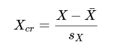

L'analyse multivariée est utile quand on souhaite étudier des profils, c'est-à-dire un ensemble de caractéristiques d'un individu.

## méthodes factorielles & classification non supervisée (clustering)

>:information_source: l'analyse en composante principale (ACP) est la plus connue des méthodes factorielles tandis que l'algorithme k-means est le plus connus des algorithmes de clustering

Ces 2 algorithmes permettent de faciliter les données pour ensuite faciliter leur analyse.

- **ACP** : réduit le nombre de variables en trouvant de nouvelles variables qui en synthétisent plusieurs (perte d'information). 
Permet d'étudier la variabilité entre les individus, quelles sont les vraisamblances et les différences ainsi que de détecter les corrélations entre les variables
- **clustering** : regroupe les individus similaires, partitionne l'ensemble des individus

## ACP

**L'enjeu de l'ACP**

>:information_source: Pour visualiser des points dans un espace à n dimensions sur un plan, la solution est d'effectuer des projections orthogonales. Le principe de l'ACP est de rechercher la projection pour laquelle l'inertie des points est maximale

Les axes principaux d'intertie sont des combinaisons linéaires des variables initiales.
Classiquement, on s'arrange pour transformer nos variables de telle manière que leur moyenne soit égale à 0 et que leur variance soit égale à 1.  
En effet, comme un axe est une combinaison linéaire des variables existantes, elles peuvent ne pas influencer de manière égales le calcul de l'axe, ce qui peut s'avérer problématique.  
Pour effectuer un centrage sur les observations, il faut soustraireà toutes ces observations leur moyenne.  
Centrer les données ne fait que déplacer (par une translation) le nuage de point de telle manière à ce que son centre de gravité coïncide avec l'origina du repère.  
Après avoir centré les données, si on les divise par leur écart-type, alors on obtient des valeurs dont la variance vaut 1 : on a fait une réduction, toutes les variables ont le même poids.

