## les types de variables

**variables quantitatives**

> :information_source: une variables quantitative peut être discrète ou continue

Ce sont les variables qui prennent des valeurs numériques, à condition que ces valeurs expriment une quantité et aient un sens lorsque l’on y applique des opérations arithmétiques.  

Si le nombre de valeurs possibles d'une variable est très grand, alors on peut la considérer comme continue. Sinon, on la considère comme discrète.

**variables qualitatives**

Ce sont les variables qui ne sont pas quantitatives. Les valeurs qu'elles prennent sont appelées des catégories ou modalités.  
Une variable qualitative peut être nominale ou ordinale.
* ordinale : les modalités peuvent être ordonnées
* nominale : si la modalité n'est pas ordinale

## représenter la distribution d'une variable

Pour une variable qualitative, on peut utiliser le pie chart ou le bar chart  
Pour une variable quantitative :
* discrète : diagramme en bâtons (bar chart mais placement précis d'un axe x)
* continues : on aggrège les valeurs en classes (discrétise), histogramme ou alors on ne discrétise pas et on utilise la fonction de répartition empirique

## représenter sous forme d'un tableau

On représente les variables/classes avec le nombre d'occurence des modalités/classes ainsi que leur fréquence d'apparition. On peut également ajouter la fréquence cumulée.

## les mesures de tendance centrale

**le mode**

Pour les variables qualitatives c'est la modalité ou la valeur la plus fréquente.  
Pour les variables quantitatives, la classe modale est la classe la plus fréquente.

**la moyenne**

Pour calculer la moyenne de valeurs, on additionne celles-ci, puis on divise le résultat par le nombre de valeurs.

**la médiane**

C'est la valeur telle que le nombre d’observations supérieures à cette valeur est égal au nombre d’observations inférieures à cette valeur.

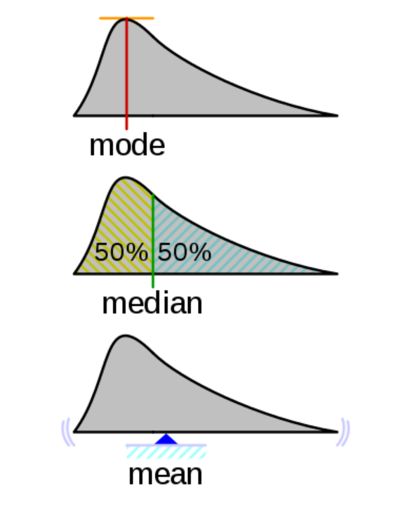

## les mesures de dispersion

**la variace empirique**

On prend toutes nos valeurs et on calcule pour chacune d'elles l'ecart qu'elles ont avec la moyenne 

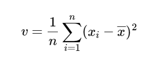

Cependant, la variance empirique est biaisé. On a donc créé la variance corrigée :

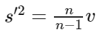

**l'ecart type empirique**

Pour avoir une unité normale (et non plus en m2 par exemple)

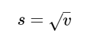

**l'ecart inter quartile**

un quartile c'est comme la médiane mais avec une proportion de 1/4. Il existe 3 quartiles :
* Q1 : 1/4 des valeurs se trouvent en dessous de Q1 et 3/4 au dessus
* Q2 : 2/4 des valeurs se trouvent en dessous de Q2 et 2/4 au dessus (c'est la médiane)
* Q3 : 3/4 des valeurs se trouvent en dessous de Q3 et 1/4 au dessus

L'écart inter-quartile est la différence entre Q3 et Q1 :

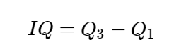

**boxplot**

Permet de représenter schématiquement une distribution, en incluant sa dispersion.

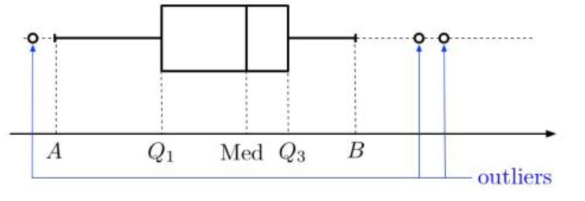

## les mesures de forme

Nous souhaitons savoir si la distribution s'étale plutôt à gauche ou à droite de la moyenne

**le skewness empirique**

C'est une mesure d'asymétrie. L'asymétrie d'une distribution traduit la régularité ou non avec laquelle les observations se répartissent autour de la valeur centrale.
* Si γ1=0 alors la distribution est symétrique.
* Si γ1>0 alors la distribution est étalée à droite.
* Si γ1<0 alors la distribution est étalée à gauche.

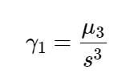

avec 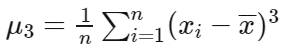

**le kurtosis empirique**

C'est une messure d'applatissement. Peut s'interpréter à condition que la distribution soit symétrique. On compare l'applatissement par rapport à la distribution gaussienne.
* Si γ2=0 , alors la distribution a le même aplatissement que la distribution normale.
* Si γ2>0 , alors elle est moins aplatie que la distribution normale : les observations sont plus concentrées.
* Si γ2<0 , alors les observations sont moins concentrées : la distribution est plus aplatie.

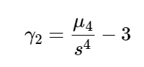

avec 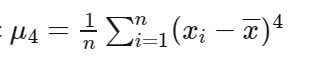

## les mesures de concentration

**la courbe de lorenz**

Permet de visualiser si une variable est répartie de manière égalitaire ou non.

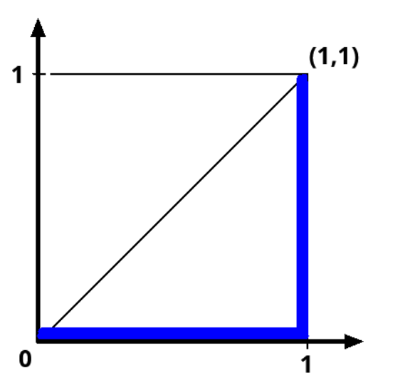

Plus la courbe de Lorenz se rapproche de la première bissectrice, plus la répartition est égalitaire.

**indice de gini**

Cet indice résume la courbe de lorenz.  
Il mesure l'aire présente entre la première bissectrice et la courbe de Lorenz.

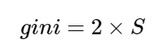

## les autres mesures

**le taux de croissance**

* si τt/0>0 , c'est qu'il y a une hausse de la variable X entre l'instant 0 et t .
* si τt/0<0 , c'est qu'il y a une baisse de la variable X entre l'instant 0 et t .

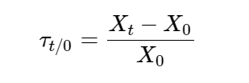

**les moyennes**

On a vu la moyenne arithmétique.

Il existe également la moyenne géométrique, notamment utilisé dans les calculs de taux de croissance moyen

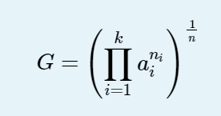

Ainsi que la moyenne harmonique, notamment utilisée dans le calcul des moyennes de pourcentages et de rapports (si on veut trouver le bon compromis entre 2 variables par exemple).

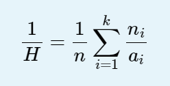