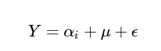

# analyse univariée

## les types de variables

**variables quantitatives**

> :information_source: une variables quantitative peut être discrète ou continue

Ce sont les variables qui prennent des valeurs numériques, à condition que ces valeurs expriment une quantité et aient un sens lorsque l’on y applique des opérations arithmétiques.  

Si le nombre de valeurs possibles d'une variable est très grand, alors on peut la considérer comme continue. Sinon, on la considère comme discrète.

**variables qualitatives**

Ce sont les variables qui ne sont pas quantitatives. Les valeurs qu'elles prennent sont appelées des catégories ou modalités.  
Une variable qualitative peut être nominale ou ordinale.
* ordinale : les modalités peuvent être ordonnées
* nominale : si la modalité n'est pas ordinale

## représenter la distribution d'une variable

Pour une variable qualitative, on peut utiliser le pie chart ou le bar chart  
Pour une variable quantitative :
* discrète : diagramme en bâtons (bar chart mais placement précis d'un axe x)
* continues : on aggrège les valeurs en classes (discrétise), histogramme ou alors on ne discrétise pas et on utilise la fonction de répartition empirique

## représenter sous forme d'un tableau

On représente les variables/classes avec le nombre d'occurence des modalités/classes ainsi que leur fréquence d'apparition. On peut également ajouter la fréquence cumulée.

## les mesures de tendance centrale

**le mode**

Pour les variables qualitatives c'est la modalité ou la valeur la plus fréquente.  
Pour les variables quantitatives, la classe modale est la classe la plus fréquente.

**la moyenne**

Pour calculer la moyenne de valeurs, on additionne celles-ci, puis on divise le résultat par le nombre de valeurs.

**la médiane**

C'est la valeur telle que le nombre d’observations supérieures à cette valeur est égal au nombre d’observations inférieures à cette valeur.

## les mesures de dispersion

**la variace empirique**

On prend toutes nos valeurs et on calcule pour chacune d'elles l'ecart qu'elles ont avec la moyenne 

Cependant, la variance empirique est biaisé. On a donc créé la variance corrigée :

**l'ecart type empirique**

Pour avoir une unité normale (et non plus en m2 par exemple)

**l'ecart inter quartile**

un quartile c'est comme la médiane mais avec une proportion de 1/4. Il existe 3 quartiles :
* Q1 : 1/4 des valeurs se trouvent en dessous de Q1 et 3/4 au dessus
* Q2 : 2/4 des valeurs se trouvent en dessous de Q2 et 2/4 au dessus (c'est la médiane)
* Q3 : 3/4 des valeurs se trouvent en dessous de Q3 et 1/4 au dessus

L'écart inter-quartile est la différence entre Q3 et Q1 :

**boxplot**

Permet de représenter schématiquement une distribution, en incluant sa dispersion.

## les mesures de forme

Nous souhaitons savoir si la distribution s'étale plutôt à gauche ou à droite de la moyenne

**le skewness empirique**

C'est une mesure d'asymétrie. L'asymétrie d'une distribution traduit la régularité ou non avec laquelle les observations se répartissent autour de la valeur centrale.
* Si γ1=0 alors la distribution est symétrique.
* Si γ1>0 alors la distribution est étalée à droite.
* Si γ1<0 alors la distribution est étalée à gauche.

avec 

**le kurtosis empirique**

C'est une messure d'applatissement. Peut s'interpréter à condition que la distribution soit symétrique. On compare l'applatissement par rapport à la distribution gaussienne.
* Si γ2=0 , alors la distribution a le même aplatissement que la distribution normale.
* Si γ2>0 , alors elle est moins aplatie que la distribution normale : les observations sont plus concentrées.
* Si γ2<0 , alors les observations sont moins concentrées : la distribution est plus aplatie.

avec 

## les mesures de concentration

**la courbe de lorenz**

Permet de visualiser si une variable est répartie de manière égalitaire ou non.

Plus la courbe de Lorenz se rapproche de la première bissectrice, plus la répartition est égalitaire.

**indice de gini**

Cet indice résume la courbe de lorenz.  
Il mesure l'aire présente entre la première bissectrice et la courbe de Lorenz.

## les autres mesures

**le taux de croissance**

* si τt/0>0 , c'est qu'il y a une hausse de la variable X entre l'instant 0 et t .
* si τt/0<0 , c'est qu'il y a une baisse de la variable X entre l'instant 0 et t .

**les moyennes**

On a vu la moyenne arithmétique.

Il existe également la moyenne géométrique, notamment utilisé dans les calculs de taux de croissance moyen

Ainsi que la moyenne harmonique, notamment utilisée dans le calcul des moyennes de pourcentages et de rapports (si on veut trouver le bon compromis entre 2 variables par exemple).

# Analyse bivariée

C'est étudier les relations entre les variables (corrélation).  
Il est possible que 2 variables soient corrélées sans qu'il n'y ait aucun lien entre elles.

## Analyser 2 variables quantitatives par regression linéaire

<ins>Graphique</ins>:

On peut utiliser le scatter plot (diagramme de dispersion). Mais pour avoir une représentation plus efficace, il est possible d'aggréger la variable X en abscisse en différentes classes. On représente ensuite une boxplot.

<ins>indicateurs numériques</ins>:

Il y a la covariance empirique de X et Y : 

Si X et Y ne sont pas corrélés, alors la somme sera proche de 0.  
Si X et Y sont corrélés et évoluent dans le même sens, on a donc que la quantité est positive.  
En revanche, si X et Y évoluent l'un dans un sens, l'autre dans l'autre sens, il y a également corrélation : on parle de corrélation négative.

Pour ramener la covariance empirique à une valeur qui soit comprise entre -1 et 1, alors on peut la diviser par le produit des écarts-types. Cette normalisation nous permet de faire des comparaisons.  
On appelle ce coefficient le coefficient de corrélation de Pearson.  
Ce coefficient ne détecte que les relations linéaires.

<ins>model</ins>:

Si on avait trouvé un modèle parfait, alors il n'y aurait plus d'erreur, et donc plus de variations entre les valeurs prédites et les valeurs réelles. Dans ce cas, on dirait que le modèle a réussi à expliquer la totalité des variations. Les variations autour de la moyenne sont mesurées par la variance. Un modèle parfait aurait expliqué 100 % de la variation.

Ce pourcentage est calculé grâce à la formule de décomposition de la variance (analysis of variance, en anglais : ANOVA).

SCT (Somme des Carrés Totale) traduit la variation totale de Y , SCE (Somme des Carrés Expliquée) traduit la variation expliquée par le modèle et SCR (Somme des Carrés Résiduelle) traduit la variation inexpliquée par le modèle.

Pour la régression linéaire, le pourcentage de variation expliquée est donné par le coefficient de détermination noté R2 :

C'est le coefficent de corrélation linéaire de Pearson.

## Analyser une variable quantitative et une variable qualitative par ANOVA

<ins>Graohique</ins>:

On utilise des boxplots

<ins>model</ins>:

Reprendre la formule de la regression linéaire ( y = aX+b ) n'a pas de sens ici car X est une variable qualitative.  
L'ANOVA est un outil de modélisation d'une variable Y quantitative par une/plusieurs variables X qualitatives.  

avec μ la moyenne d'une modalité de référence
et αi l'écart de la modalité du point considéré

Si on veut connaitre le salaire moyen des habitants de pluton, on prend comme référence la moyenne de salire de la terre auquel on rajoute l'écart entre la moyenne terre-pluton et on rajoute le résidut (valeurs que le modèle n'a pas pu capturer) c'est à dire la distances entre les points et la moyenne de pluton.

Si la variance intergroupe est grande devant les variances intragroupe, alors plus l'effet des sauces est importantes.

On peut calculer le rapport de corrélation  

Si le facteur est égal à 0, les moyennes des classes sont toutes égales, il n'y a pas de relation entre X et Y.

## Analyser deux variables qualitatives avec le Chi-2

On peut commencer par faire un tableau : 
* on compte le nombe de fois ou une modalité apparait, c'est l'effectif de la modalité
* on divise cet effectif par la taille de l'échantillon , c'est la fréquence d'apparition

Ensuite on peut faire le tableau de contingence : 

Si deux événements I et J sont indépendants, alors on s'attend à ce que le nombre d'individus qui satisfont à la fois I et J (appelons ce nombre nij ) soit égal à fi×nj. Au contraire, plus nij sera différent de fi×nj , plus on aura de raison de penser que I et J ne sont pas indépendants.

Etudier une corrélation entre deux variables qualitatives revient donc à comparer les  nij  avec les fi×nj.

Et en sommant :

Plus ce facteur est grand, plus l'hyphothèse d'indépendance est valide.

# Nettoyage des données

<ins>traiter les valeurs manquantes, les outliers et les doublons</ins>:

<ins>valeurs manquantes (imputation)</ins>

Essayer de deviner une valeur manquante s'appelle l'imputation.  
* on peut remplacer les valeurs d'une variable par la moyenne de cette variable.
* pour remplacer une variable donnée, on peut regarder les variables aux alentours (hot-deck, regressions linéaires)

**Regarder la distribution de la variable (au moins les quantile) avant et après l'imputation, pour voir si sa forme n'a pas été impactée**

<ins>outliers</ins>

La moyenne est très sensible aux outliers alors que la médiane non.  
* supprimer la valeur
* conserver la valeur

